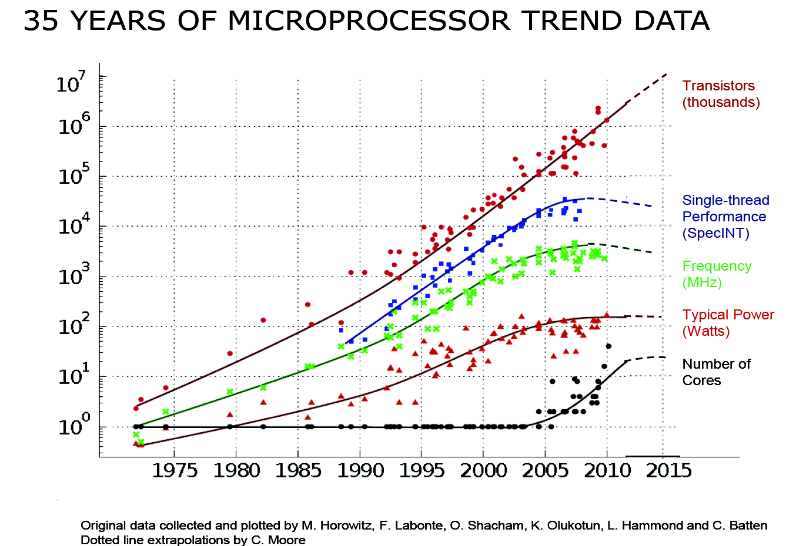
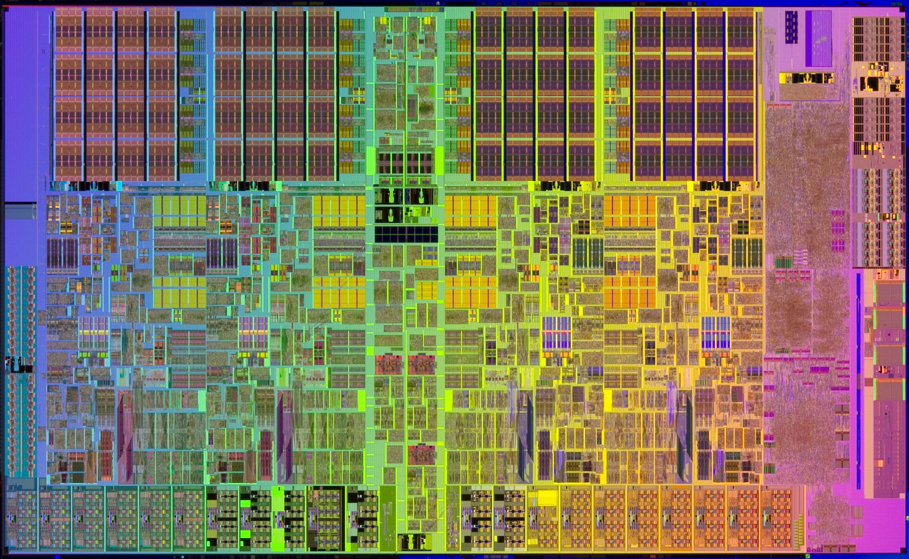
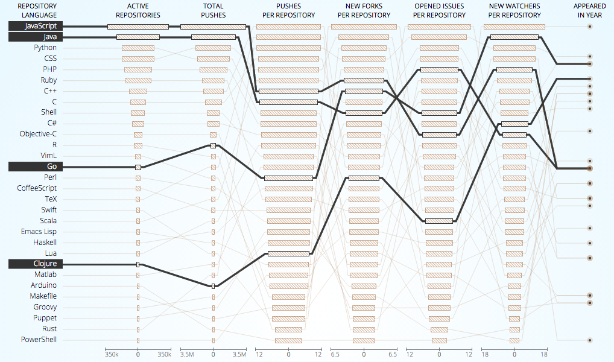

Golang or the future of the dev
===

The free lunch is over. Better yet, the free lunch was already over in 2005 and right now we're starting to pay for it, even though we aren't aware of it.

"The free lunch is over" or "a fundamental turn toward concurrency in software" is a paper by Herb Sutter published in Dr.Dobb's Journal back in March 2005. In it, the author clearly describes the state of the art of hardware innovation in 2005: the Moore Law applied to clock speed had stopped as did the total performance per clock and the overall power. Do you remember the days when the GHz specs where in front of every ad? Well, 3GHz CPU were introduced in 2004 and today in 2016 my MacBookPro provides a staggering... 2.7GHz. This physical wall has many implications in the world of software with much of the theory already laid out by C.A.R. Hoare in his famous paper "Communicating Sequential Processes", one of the main inspiration of GoLang.

Fast forward to 2016 and we can conclude that not only clock speeds have not increased in a decade, but also that the number of transistors per dollar has started to fall. In other words, don't let the above graph confuse you: adding more transistors is not the solution. This is because at smaller scale some quantum properties starts to emerge (*tunneling*) and because it actually costs more to put more transistors. Again, the free lunch is over.

## More walls
Back in 2005 the near-term future performance growth drivers were:	
- hyperthreading	
- multicore	
- cache

Caches have physical limits: the bigger the cache, the slower it gets. Modern CPUs have L1 and L2 caches directly inside the chip to reduce distances. As the speed of light is not going anywhere faster, distance - even if measured in *nm* - equals speed. Caches are much more fast than RAM, but again, they have limits. 

Over the last decade performance, especially on the server, has been dictated by adding more CPU cores. But multicore CPU comes at a cost too and cannot scale indefinetely: not every application can exploit multicore and the syncronization overhead between the operations hits performance very fast. Some compute-intensive operations that can be massively parallelised (like deep learning, analytics and engineering or simulation) can benefit from GPU-accelerated computing.

Much of the improvement in performance in the last two decades has come from architectural improvements:

- out of order execution (super-scalar)
- speculative execution
- vector (SSE) instructions

> "Modern processors are a like nitro fueled funny cars, they excel at the quarter mile. Unfortunately modern programming languages are like Monte Carlo, they are full of twists and turns."
> --David Ungar, OOPSLA (year unknown)

## The solution, part 1: better software
All the above points lean toward one crucial point: if we cannot safely rely on the hardware to increase the performance, we need to turn to software. And boy what a mess we have there. 

Most of the traditional programming languages comes from the 90's and uses traditional single-threaded processes. Multi-threading is of course possible but it's messy, complicated and way too expensive. Let's look at the creation of a Thread in Java: the creation of a thread start out at 1Mb, along with a region of memory called a guard page that acts as a guard between one thread's memory and another.

This means that, if creating a web server, creating one thread per request will eventualy lead to an `OutOfMemoryError`. Moreover, threads have significant setup and teardown costs because it has to request resources from the OS and return it once its done.

However, even though most programming languages have *support* for multi-threading, the real problem comes with concurrent execution and the perils of threading-locking, race conditions and deadlocks. For more on the difference between concurrency and parallelism, go see Rob Pike's excellent talk [concurrency is not parallelism](https://blog.golang.org/concurrency-is-not-parallelism). Spoiler: parallelism is doing the same thing at once, while concurrency can involve parallelism, but it's more doing different things at once. As one can quickly see, in the latter case, communication between the "tasks" - or processes - becomes crucial.

Another separate chapter should be dedicated to Object-Oriented-Programming (OOP): in JAVA everythings quickly becomes a pointer which puts lots of preassure on the heap thus running around the CPU, which is not very memory-effective. So what? Are we back to `C`'s `allocs` and `free`? Of course not.

For best performance on today's hardware in today's world, we need a programming language which:

- Is compiled, not interpreted.
- Permits efficient code to be written.
- Lets programmers talk about memory effectively, think structs vs java objects
- Has a compiler that produces efficient code, it has to be small code as well, because cache.

## The solution, part 2: better programming languages
I think that the development community will be much more fragmented in the future than it is already today. However, if the fragmentation lines are now between programming languages (and further down to frameworks within a PL - PHP, JS, anyone? -), the fragmentation lines of the future could very well become over complexity and optimization. In this new world, the real confrontation can occur over the comparison between something like NodeJS and GoLang.

NodeJS is relatively easy to write and run, even though 

> On production you need to perform a series of pre-tasks to get your project ready that make the ritual to summon Satan look like a boiled eggs recipe.
> Jose Aguinaga, [How it feels to learn Javascript in 2016](https://hackernoon.com/how-it-feels-to-learn-javascript-in-2016-d3a717dd577f#.nke7ozrlm)

However, besides all the Babel(s), Typescripts and ES6-ES2016(s) the adoption of JS - especially between corporate - is not slowing down. 

This comes down to several reasons, but especially the relative ease of finding devs (front-end devs are already familiar with the language) and the vast ecosystem of libraries and tools.

Despite the awesomness of the V8 engine and the tricks that can be done on the event loop, NodeJS is single-threaded. As such, it cannot directly use multi-core CPUs even though it is possible to spawn different processes on several threads.

On the other side of the spectrum, GoLang is heavily addressed as the new `C` and especially as a replacement for `C++`. Golang is functional in nature (although it has structs that can be used for OOP), it's compiled and - horror! - it's garbage collected. However, its runtime is incredibly clever and, most importantly, it is designed from the ground-up to exploit multi-cores. Infact, it has its own abstractions over threads (called `goroutines`) that are automatically managed and can communicate with `channels`.

The creation of a goroutine is very cheap: it's just 2kb (again, a thread requires 1Mb) and the runtime automagically manages them so that they are put on threads when running and rmoved when blocking. Several optimizations can be performed but it's somewhat predictable whether or not a variable will be allocated on the heap or on the stack.

## The solution, part 3: better developers
A common belief seems to be that in the future, it will be easier to do programming. I disagree. I think that actually the inverse is true. And the reason is because if hardware isn't getting any more faster, then better performance is achieved with optimization, and that is hard.

Optimization requires not only the mastering of the tool (the software) but also an extensive knowledge of the matter (the hardware). Moreover, the developer of the future needs to be even more open-minded than the one of the past. Researchers and Universities are sometimes critical of programming languages like Go - and *sometimes* rightfully so - but the point is not to look at the past and converge on classic OO paradigms, but to improve what is here to stay.

# Conclusion
In conclusion and to wrap-up, hardware limits are putting more preassure on the software. Even though we will not stop to have faster CPUs due to incremental changes and innovation in the architecture, as developers we need to start to think more of optimization and best-coding and best-development practices. GoLang is the programming language more suited for this kind of development, but that's not enough. Developers needs to understand more about the hardware too to be able to exploit the full range of mult-core and concurrent development. 

Better developers will have a huge impact on the end user too. Optimized software can run on cheaper and slower hardware. This translates to less expensive cloud servers, higher margins for corporations and overall cost reduction for the end-user. Imagine to run a full-fledged OS with all the capabilities of a modern-day computer on a mobile phone. Think of your mobile phone as your primary and unique computer or to more powerful IoT devices and you can see where optmization can lead innovation in the future.